# Complete App with GraphQL, Node.js, MongoDB and React.js

## Project Overview
This is a complete app with GraphQL, Node.js, MongoDB and React.js. This app is a simple CRUD app with a list of books. The app is divided into two parts: the server and the client. The server is built with Node.js, Express.js, GraphQL and MongoDB. The client is built with React.js and Apollo Client.

## Features
- Server
  - Node.js
  - Express.js
  - GraphQL
  - MongoDB
  - Mongoose
- Client
  - React.js
  - Apollo Client

## Structure
Application structure is divided into tree main parts: API, DB and UI. 

```mermaid
architecture-beta
    service db(mdi:database)[MongoDB]
    service react(mdi:react)[ReactJS SPA]
    service charts(mdi:chart-line)[incl charts]
    service server(mdi:graphql)[GraphQL API]

    db:L <--> R:server
    react:B --> T:server
    react:R --> L:charts
```



## App Design


## Init project
### Init git with .gitignore
```bash
git init
```
.gitignore
```bash
/node_modules
/dist

.env
.DS_Store
```
### Init npm
```bash
npm init -y
```
### Init typescript
```bash
npm i --save-dev typescript tsx
npx tsc --init
```
More tsconfig bases https://github.com/tsconfig/bases

### Init ESLint
```bash
npm i --save-dev eslint
npx eslint --init
``` 

### Instal express
```bash
npm i --save express body-parser express-graphql graphql mongoose dotenv
npm i --save-dev @types/express
``` 

### Install graphql
```bash
npm i --save express-graphql graphql
``` 