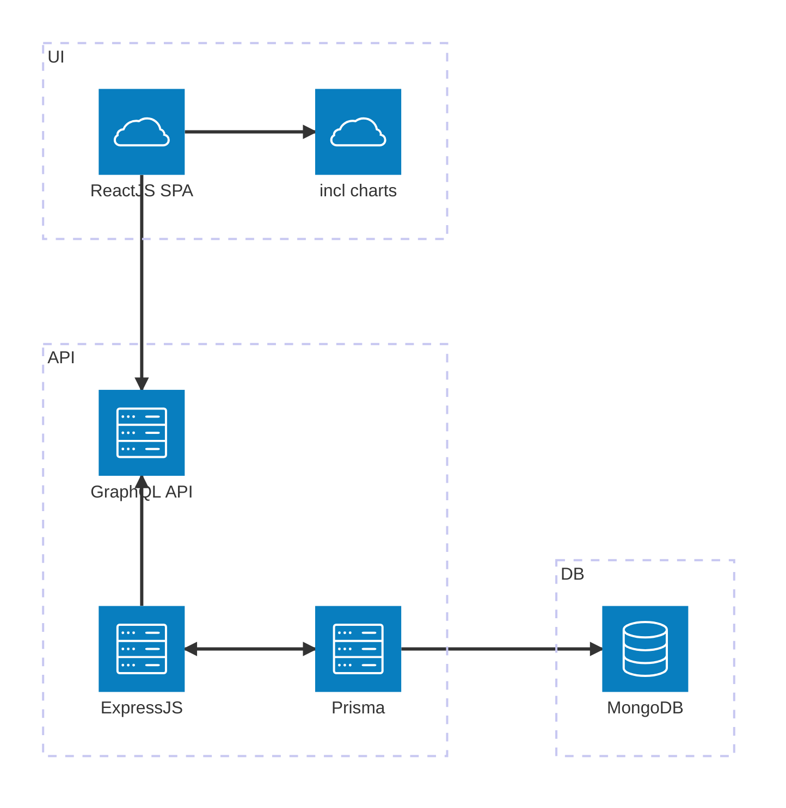
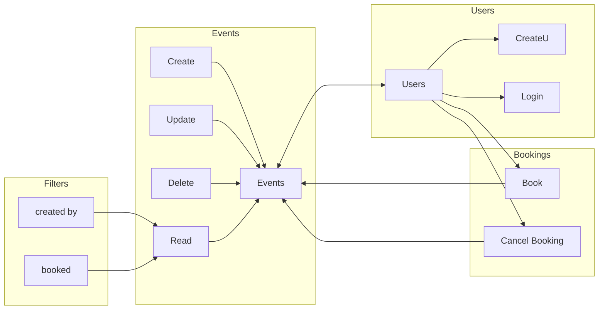

# Complete App with GraphQL, Node.js, MongoDB and React.js

## Project Overview

This is a complete app with GraphQL, Node.js, MongoDB and React.js. This app is a simple CRUD app with a list of events and event bookings. The app is divided into two parts: the server and the client. The server is built with Node.js, Express.js, GraphQL and MongoDB. The client is built with React.js and Typescript.

Repository is a monorepo with server and client in separate folders.

Starting the project development:

```bash
pnpm start
```

## Features

- Server
  - Express.js
  - GraphQL
  - Prisma
- Database
  - MongoDB
- Client
  - React.js

## Structure

Application structure is divided into tree main parts: API, DB and UI.



## App Design



## Init project

### Init git with .gitignore

```bash
git init
```

.gitignore

```bash
/node_modules
/dist

.env
.DS_Store
```

### Init npm

```bash
npm init -y
```

### Init typescript

```bash
npm i --save-dev typescript tsx
npx tsc --init
```

More tsconfig bases https://github.com/tsconfig/bases

### Init ESLint

```bash
npm i --save-dev eslint
npx eslint --init
```

### Instal express

```bash
npm i --save express body-parser express-graphql graphql mongoose dotenv
npm i --save-dev @types/express
```

### Install graphql

```bash
npm i --save express-graphql graphql
```

### Install Database

#### MongoDB

Refer to https://www.prisma.io/dataguide/mongodb/setting-up-a-local-mongodb-database

#### Prisma ORM

```bash
npm i --save-dev prisma
npm i --save @prisma/client
npx prisma init
```

Update schema.prisma and .env to corresponding MongoDB settings

Pull DB schema and generate client

```bash
npx prisma db pull
npx prisma generate
```

### Install React

```bash
pnpm create vite client
pnpm --filter client install
```

